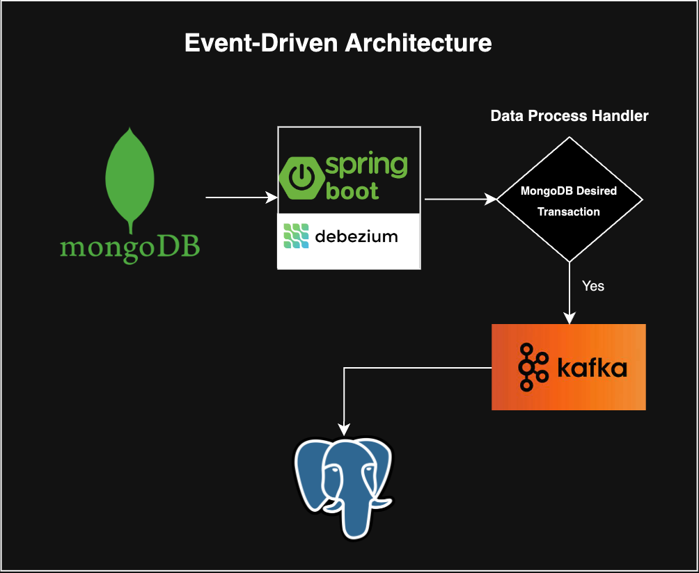

## __Spring Boot Debezium - Change Data Capture__

###### Requirements

* JDK 17(openjdk-17)
* Maven 3.6.3 or newer
* Spring Boot 3.3.0-SNAPSHOT
* Debezium Embedded
* Debezium API
* Debezium MongoDB Connector
* MongoDB
* Spring Kafka
* Docker

---

###### 1. Run MongoDB & PostgreSQL on Docker
```sh
docker-compose up -d
```
###### 2. Run Kafka and ZooKeeper
```sh
docker-compose -f docker-compose-kafka.yml up -d
```
###### 3. Build Project
```sh
mvn clean install
```
###### 4. Run App
```sh
mvn spring-boot:run
```

### The Flow Diagram of the Application

